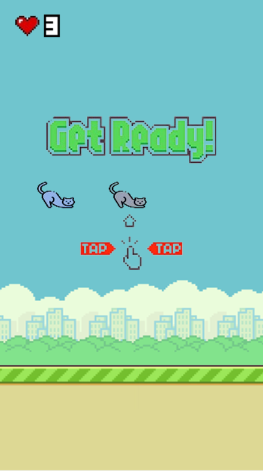
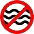
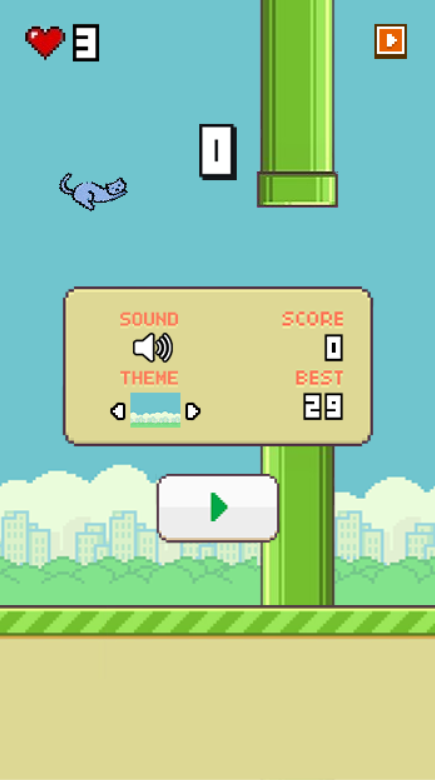
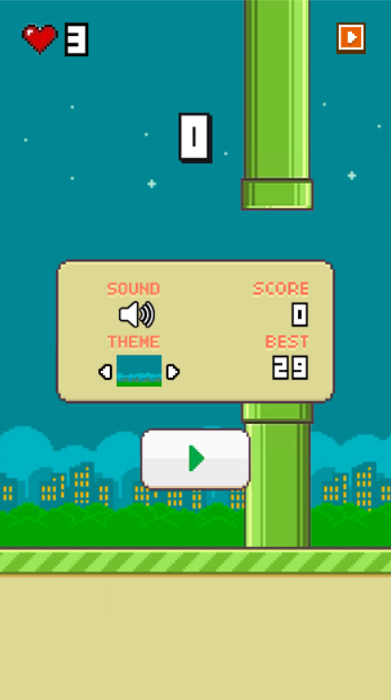

# Flappy Catty

- Video Demo:

# Giới thiệu game

* Flappy Catty được dựa theo ý tưởng của game [Flappy Bird](https://vi.wikipedia.org/wiki/Flappy_Bird) - tựa game nổi tiếng do Nguyễn Hà Đông phát triển, có bổ sung thêm các tính năng bổ trợ, 
trạng thái của cột để tăng độ khó và sức hấp dẫn cho game với nhân vật mèo.
*  Flappy Catty được viết bằng thư viện [SDL2](https://www.libsdl.org/download-2.0.php) và ngôn ngữ C++.
_* Các hình ảnh và âm thanh dùng trong game được sưu tầm từ nhiều nguồn Internet và phần lớn đã được edit để phù hợp với tính chất của game

- [0. Cách tải game](#0-cách-tải-game)
    * [a. Cách 1: Tải game và chạy trực tiếp ở file.](#a-cách-1-tải-game-và-chạy-trực-tiếp-ở-file)
    * [b. Cách 2: Bao gồm code và các file thư viện có thể biên dịch.](#b-cách-2-bao-gồm-code-và-các-file-thư-viện-có-thể-biên-dịch)
- [1. Hướng dẫn chơi](#1hướng-dẫn-chơi)
- [2. Pause Menu](#2pause-menu)
- [Về đồ họa của game:](#về-đồ-họa-của-game)
- [Về source code game](#về-source-code-game)

# 0. Cách tải game

## a. Cách 1: Tải game và chạy trực tiếp ở file

Tải game (được nén thành .zip) tại link
sau: [https://drive.google.com/file/d/1GPuvOdQ6UMWOnBe6koM5TIp6ieZSVZAY/view?usp=sharing](https://drive.google.com/file/d/1meDX4YbNVpZsfbP0UOXizaugDWbPNNnm/view?usp=sharing)<br/>
Cách này tiết kiệm bộ nhớ và thời gian tải đi rất nhiều (khoảng 7MB).<br/>
Giải nén game vào một thư mục và bật Flappy Catty.exe lên và chơi.<br/>

## b. Cách 2: Bao gồm code và các file thư viện có thể biên dịch.

**Bước 1:** Clone repo này về. <br/>
Hoặc Chọn Code -> Download Zip

- Tất cả code đều nằm trong thư mục code.<br/>
- Tất cả dữ liệu hình ảnh và âm thanh cho game nằm trong thư mục res.
- Thư viện SDL2 (bao gồm cả SDL2_mixer và SDL2_image) nằm trong thư mục src.

**Bước 2:** Cài mingw. Ở đây tôi cài đặt phiên bản MinGW-W64
GCC-13.2.0 (Có thể cài theo phiên bản ở đây https://www.msys2.org/ để có hướng dẫn chi tiết) .<br/>
Một số chú ý: <br/>

- Nếu sử dụng trình biên dịch khác thì phải dịch lại icon: vào thư mục icon rồi dùng
  lệnh `windres main.rc -O coff main.res` trong cmd.<br/>

**Bước 3:** Cài GNU make

**Bước 4:** Mở cmd trong thư mục chứa Makefile và gõ lệnh make.

**Bước 5:** Bật Flappy Catty.exe và chơi

# 1. Hướng dẫn chơi

Sau khi mở game ra chúng ta có giao diện như sau:
<div style="text-align: center;">



</div>

Khi bắt đầu, người chơi sẽ có sẵn 3 trái tim tương ứng với 3 mạng có thể hồi phục (Khi trái tim được sử dụng, mèo có thể vượt qua chướng ngại vật nhưng không được tính điểm). 
Sau đó click chuột vào bất kì vị trí nào ở màn hình game hoặc nhấn phím Space hoặc nhấn phím mũi tên hướng lên để bắt đầu.

<div style="text-align: center;">


</div>

Người chơi sẽ sử dụng 1 trong 3 cách: Nhấp chuột, nhấn phím Space hoặc nhấn phím Up để mèo bay lên kết hợp với việc để mèo rơi tự do để điều khiển mèo qua các ống hiện ra.
Bên cạnh đó sẽ có những bổ trợ để hỗ trợ người chơi:


</div>

Đây là bổ trợ giúp chú mèo của bạn có thể vượt qua một số cột nhanh chóng mà không gặp vấn đề gì.


</div>

Đây là bổ trợ khiến cho gia tốc trọng trường tăng lên.



</div>

Đây là bổ trợ ổn định các cột trong một khoảng thời gian. <br/>
Ngoài ra, người chơi có thể tạm dừng bằng cách nhấn phím Esc hoặc ấn vào nút Pause trên màn hình. Khi tạm dừng, ta có thể chỉnh sửa một cài đặt cơ bản trong game.

# 2. Pause Menu

<div style="text-align: center;">


</div>

Ở đây chúng ta có thể thấy số điểm hiện tại, số điểm cao nhất, trạng thái âm thanh và nền hiển thị.
Người chơi có thể chỉnh sáng nền tối nếu muốn.

<div style="text-align: center;">


</div>

### Về đồ họa của game:

Chủ yếu là hình ảnh chỉnh sửa lại được lấy từ Google Image Search.

### Về source code game:

- Class gTexture khởi tạo trong lib.h và lib.cpp:
    * Khởi tạo một số biến cơ bản xuyên suốt trò chơi
    * Chứa hầu hết thông số cơ bản của game
    * Chứa hầu hết các câu lệnh của SDL2, SDL2_image, sử dụng để vẽ load ảnh, và vẽ lên renderer, window.
    * Các class còn lại đều dựa trên class gTexture
- Class Add-ons: Tạo ra và render các hình ảnh bổ trợ
- Class Background: Tạo ra và render nền
- Class Catty: Tạo ra và render nhân vật chính - Mèo Catty:
    * Kiểm tra va chạm của mèo với cột
    * Cho phép mèo rơi tự do theo phương trình chuyển động đối với gia tốc trọng trường trong game
- Class Game: Xử lý các lệnh của game và tạo ra trò chơi (Vai trò như hàm main của trò chơi)
- Class Land: Tạo ra và render mặt đất
- Class Pipe: Tạo ra và render các cột ống:
    * Random ra độ cao của cột
    * Thay đổi sự dịch chuyển độ cao của cột thông qua phần dư độ cao của cột để tạo ra sự bất ngờ của sự dịch chuyển của cột
       ```php
          posPipe[i].x -= pipeMove;
          if (posPipe[i].y % 50 == 0) move = -move;
          if (posPipe[i].y + move > 0 || posPipe[i].y + move < -PipeHeight) move = -move;
          posPipe[i].y += move;
       ```
       
- Class Setup: Tạo ra các xử lý cơ bản, các hàm kiểm tra một số va chạm và thông số ở trong game đồng thời set up cho chương trình chạy:
    * Khởi tạo window và renderer
    * Khởi tạo và load các class cơ bản
    * Render một số chi tiết của game như điểm số, menu, các nút, trái tim, số mạng,...
    * Cập nhật một số thông số của game và kiểm tra va chạm bổ trợ với mèo.
    * Hàm Cleanup để giải phóng dung lượng khi không sử dụng đến
- Class Sound_Effect: Tạo ra âm thanh đồng thời xử lí âm thanh
